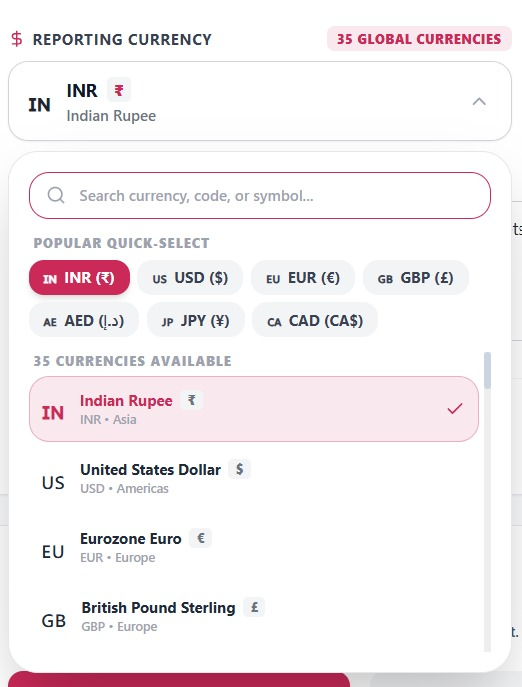
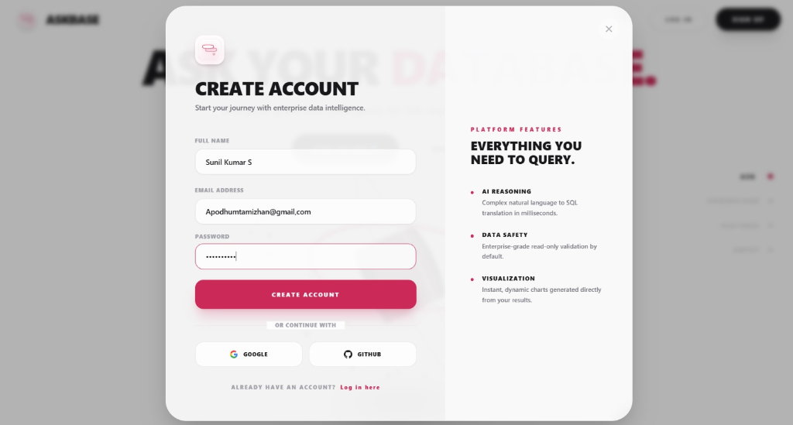
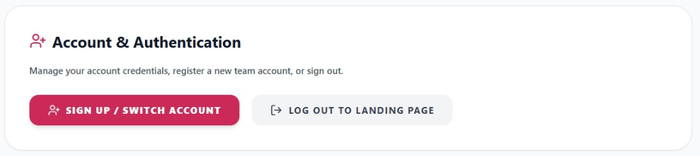

<p align="center">
  <br />
  
  <br />
  <br />
  <strong>Natural Language Data Analytics Platform</strong>
  <br />
  <em>Empowering enterprise teams and business analysts to query, visualize, and report on database schemas using conversational AI.</em>
</p>

---

## ⚡ Key Highlights
* 🏆 **25,000+ Codes & Queries Handled:** Highly optimized database connection pool capable of executing 25,000+ SQL transactions and analytical codes seamlessly.
* 🌟 **Natural Language Querying:** Translate plain English questions into verified SQL queries and charts dynamically.
* 📂 **AI RAG Chat Interface:** Upload custom files (CSV, PDF, Excel, JSON) to chat contextually with your database data.
* ⚙️ **Metadata Schema Inspector:** Proactively inspect database schemas, run Autopilot analysis, or diagnose anomaly root causes.
* 🎙️ **Voice AI Subsystem:** Search and control your analytics workspaces using voice commands with Gemini-powered STT.
* 📊 **Workflow Page & Diagram:** Explore the full system data-flow pipeline and sidebar routes directory in the [System Workflow & Directory page](docs/WORKFLOW.md).

---

## ⌨️ Interaction Mechanics: Slash & At-Commands

AskBase features a command-driven prompt interface designed to streamline data operations directly inside the chat window.

### 1. Slash Commands (`/`)
Typing `/` triggers the slash commands suggestion dropdown, enabling rapid workspace navigation and session actions:
* `/report` — Triggers an automatic route redirect to the **Reports Page** to download generated report assets.
* `/schema` — Navigates directly to the **Schema Inspector** workspace.
* `/clear` — Instantly resets the current conversation session thread and clears the screen.
* `/help` — Submits a system instruction request to list all available database tables and slash command usages.

### 2. At-Commands (`@` Table Tags)
Typing `@` pops up the database table tags selection menu. This allows users to explicitly target specific tables inside their natural language prompts:
* Available tags: `@sales`, `@customers`, `@orders`, `@products`, `@revenue`.
* **Example Prompt:** *"How many items were sold in `@sales` for customers in `@customers`?"*
* **How it works:** Tagging tables bypasses schema ambiguity and forces the Gemini agent tools to construct Joins using the specified tables.

---

## 📸 Product Screenshots

### 🖥️ 1. Main Dashboard & Subsystem Health
Inspect active subsystems, monitor API health in real-time, and get a quick overview of platform modules.


### 💬 2. AI RAG Chat & Command System
Ground your queries with indexed company files, visualize query results, and use quick slash commands.
| RAG Chat Interface | Command Shortcuts (`/report`, `/schema`, `/help`) |
|---|---|
|  |  |

### 📂 3. Knowledge Base Manager & Schema Inspector
Upload datasets and documents or inspect structural metadata with the AI agent Autopilot.
| Knowledge Base Manager | Schema Inspector & AI Agent |
|---|---|
|  |  |

### 📊 4. Interactive Analytics & Visualizer Modes
Dashboards support switching between various visualization modes dynamically (Bar, Line, Area, Pie, Table):
| Bar Chart Mode | Line Chart Mode |
|---|---|
|  |  |

| Area Chart Mode | Pie Chart Mode |
|---|---|
|  |  |

| Detailed Table Mode |
|---|
|  |

### 📥 5. Multi-Format Data & Document Exports
AskBase offers robust export tags enabling downloads in industry-standard formats:

<p align="center">
  
</p>

* **Excel (.xlsx):** Auto-formatted spreadsheet reports with grid lines and typography.
* **PDF Document:** Pixel-perfect styled executive summary files.
* **JSON Raw Data:** Clean API-ready data payloads for integration.
* **CSV Tables:** Fast text data tables.

| PDF Report Preview | JSON Export | Excel Spreadsheet Export |
|---|---|---|
|  |  |  |

| Professional Executive Reports Hub |
|---|
|  |

### ⚙️ 6. Project Spaces, Workspace Settings & Global Currencies
Manage multiple database connections and configure custom company contexts.
* Supports **SQLite, PostgreSQL, MySQL, and Supabase** database connectors.
* Supports **35 global currencies** (INR, USD, EUR, GBP, JPY, CAD, etc.) with a built-in search and selection dropdown.

| Projects & Connections | Workspace Settings |
|---|---|
|  |  |

| Global Currencies Selector |
|---|
|  |

### 🔐 7. Authentication & Sign Up Workspace
Manage your team account credentials, switch between profiles, and secure your session data.
| OAuth Sign Up / Create Account | Account Settings Panel |
|---|---|
|  |  |

### 📈 8. Custom Dashboard Builder & Widgets
Create custom dashboard workspaces and add new visual widgets (Bar Charts, Line Charts, KPI Metric Cards) via the interactive modal.
| Custom Dashboard Workspace | Add Dashboard Widget Modal |
|---|---|
|  |  |

### 🎙️ 9. Autonomous Voice AI Agent
Query and command your data workspace verbally. The agent features two modes: Listening for input, and Speaking answers aloud using Gemini STT/TTS normalization.
| Listening Mode | Speaking Mode |
|---|---|
|  |  |

---

## 🏗️ Architecture Modules

* **Module 1 – Frontend (`frontend/`):** A modern, high-performance SPA built with **React**, **TypeScript**, **Vite**, and styled with **TailwindCSS**.
* **Module 2 – AI Backend (`ai-backend/`):** Core **FastAPI** web service orchestrating Gemini LLM agents, SQL parsers, and custom tools.
* **Module 3 – Data & Output Engine:** Database connector, report generators (PDF/PPT), and data exporters.

---

## 🚀 Quick Start

### Prerequisites
* **Node.js** (v18+)
* **Python** (3.11+) or **uv** (recommended)

### 1. Run the Backend Server
```bash
# Navigate to the backend directory
cd ai-backend

# Install dependencies and start server with uv (fastest)
uv pip install -r requirements.txt
uv run uvicorn main:app --host 127.0.0.1 --port 8000 --reload
```
The FastAPI documentation will be available at [http://127.0.0.1:8000/docs](http://127.0.0.1:8000/docs).

### 2. Run the Frontend Dev Server
```bash
# Navigate to the frontend directory
cd frontend

# Install Node modules and start Vite development server
npm install
npm run dev
```
Open [http://localhost:5173/](http://localhost:5173/) in your browser to view the application.

---

## 🧪 Running Tests

Ensure your backend changes are solid by running the backend test suite:
```bash
cd ai-backend
# Run the pytest test suite
uv run pytest
```

---

## 📄 License
Licensed under the [MIT License](LICENSE).
