<p align="center">
  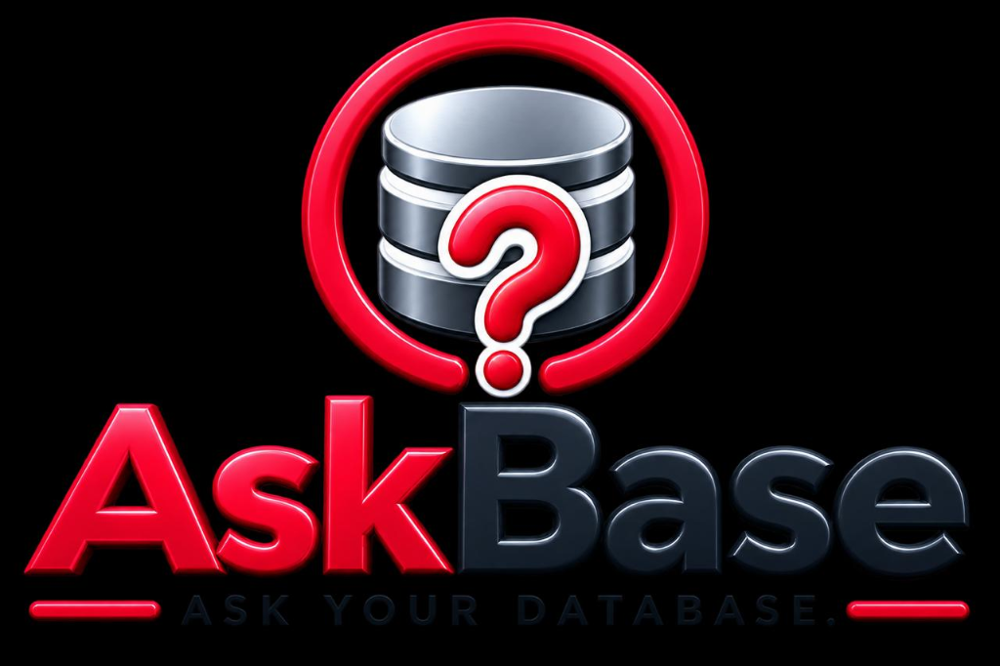
</p>

# AskBase

> Natural Language Data Analytics Platform

---

## ⚡ Key Highlights
* 🏆 **25,000+ Codes & Queries Handled:** Highly optimized database connection pool capable of executing 25,000+ SQL transactions and analytical codes seamlessly.
* 🌟 **Natural Language Querying:** Translate plain English questions into verified SQL queries and charts dynamically.
* 📂 **AI RAG Chat Interface:** Upload custom files (CSV, PDF, Excel, JSON) to chat contextually with your database data.
* ⚙️ **Metadata Schema Inspector:** Proactively inspect database schemas, run Autopilot analysis, or diagnose anomaly root causes.
* 🎙️ **Voice AI Subsystem:** Search and control your analytics workspaces using voice commands with Gemini-powered STT.

---

## 📸 Product Screenshots

### 🖥️ 1. Main Dashboard & Subsystem Health
Inspect active subsystems, monitor API health in real-time, and get a quick overview of platform modules.
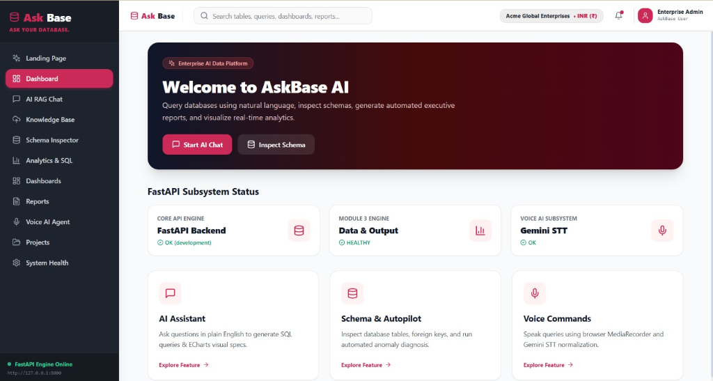

### 💬 2. AI RAG Chat & Command System
Ground your queries with indexed company files, visualize query results, and use quick slash commands.
| RAG Chat Interface | Command Shortcuts (`/report`, `/schema`, `/help`) |
|---|---|
| 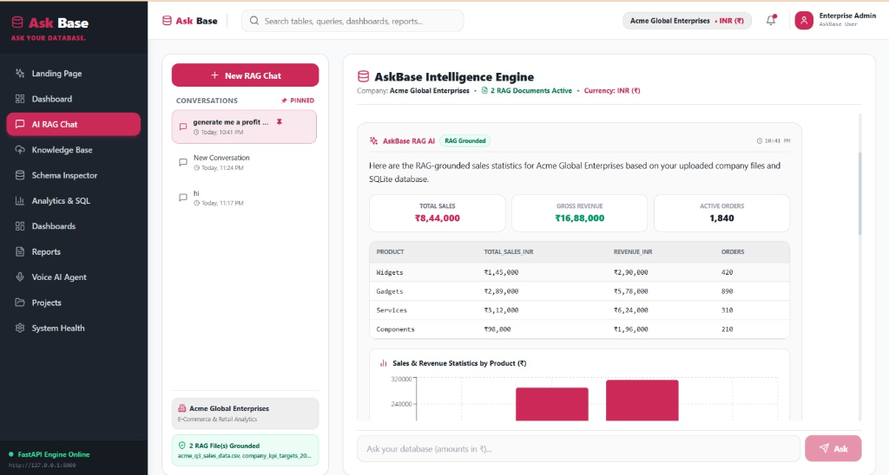 | 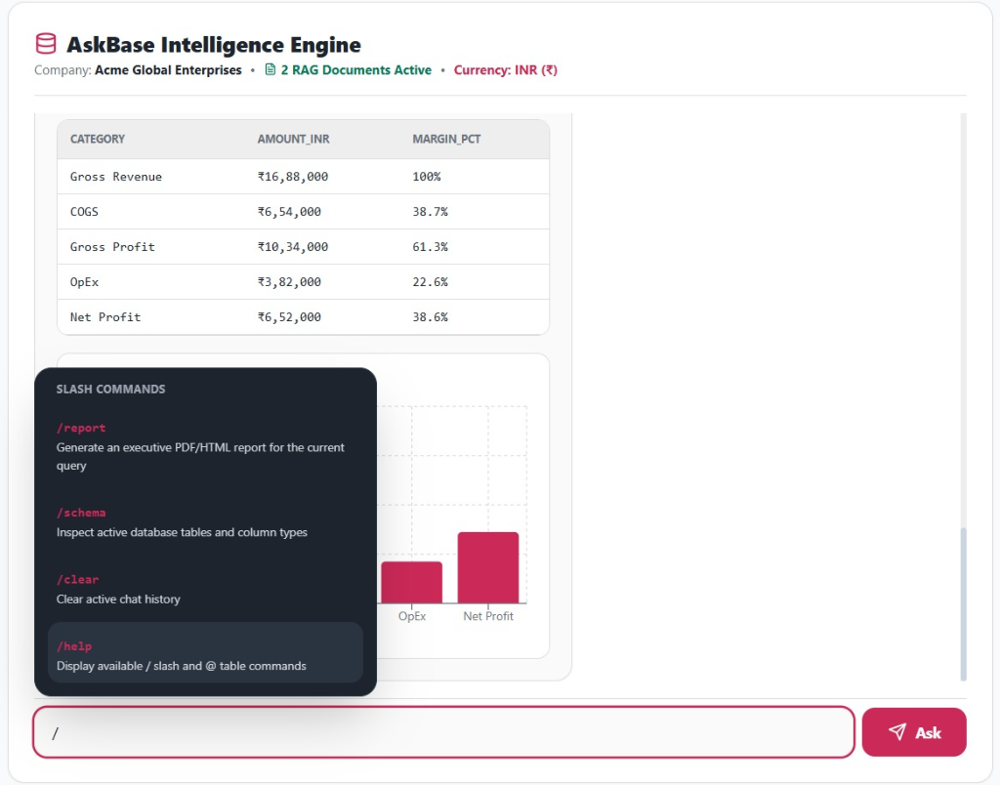 |

### 📂 3. Knowledge Base Manager & Schema Inspector
Upload datasets and documents or inspect structural metadata with the AI agent Autopilot.
| Knowledge Base Manager | Schema Inspector & AI Agent |
|---|---|
| 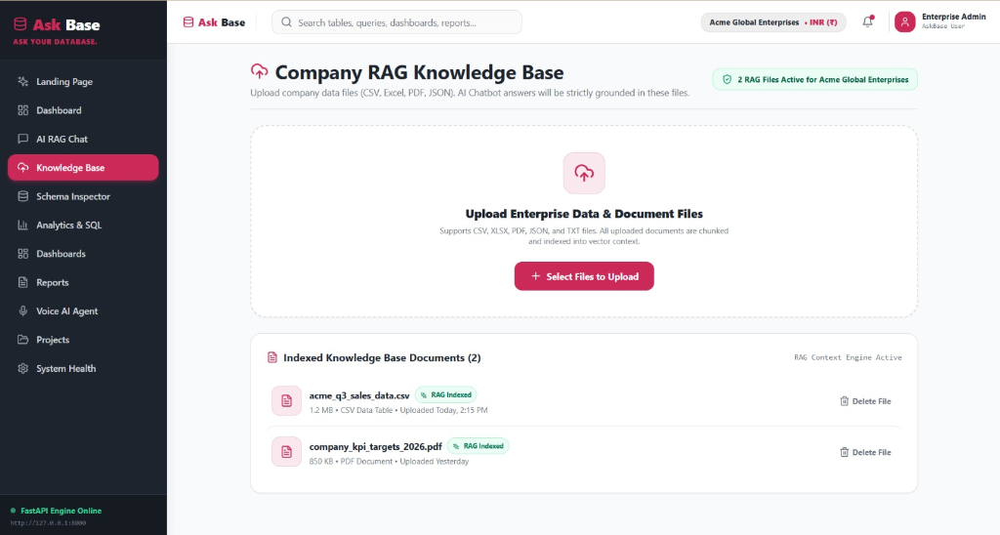 | 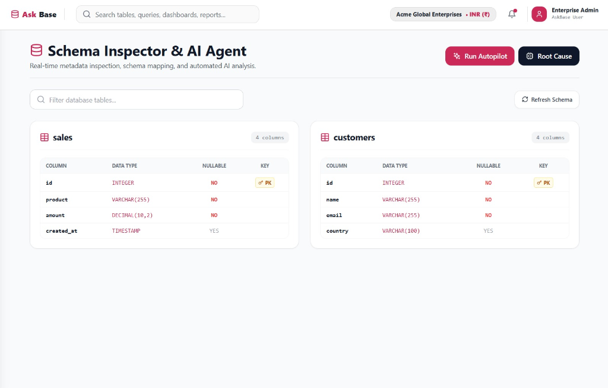 |

### 📊 4. Interactive Analytics & Visualizer Modes
Dashboards support switching between various visualization modes dynamically (Bar, Line, Area, Pie, Table):
| Bar Chart Mode | Line Chart Mode |
|---|---|
|  | 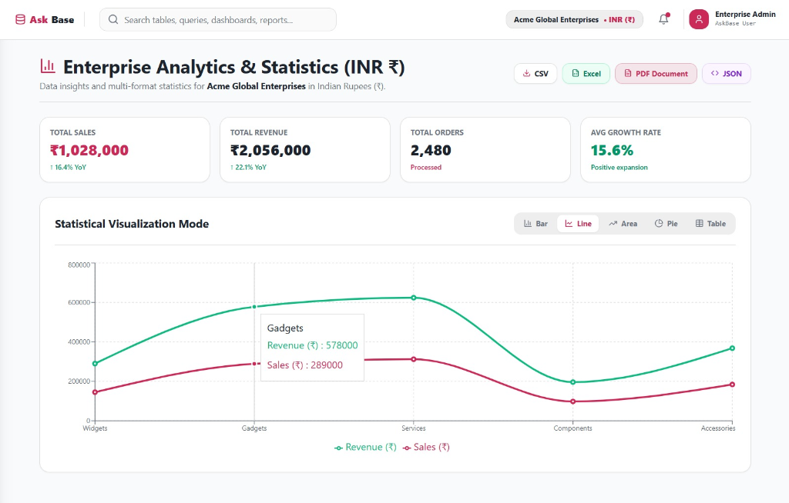 |

| Area Chart Mode | Pie Chart Mode |
|---|---|
| 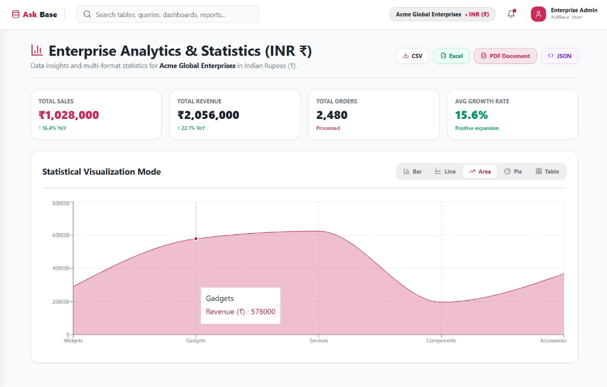 |  |

| Detailed Table Mode |
|---|
| 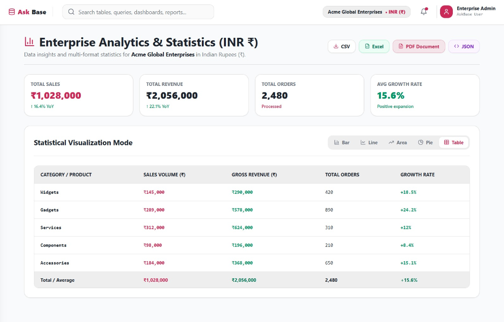 |

### 📥 5. Multi-Format Data & Document Exports
AskBase offers robust export tags enabling downloads in industry-standard formats:

<p align="center">
  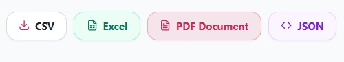
</p>

* **Excel (.xlsx):** Auto-formatted spreadsheet reports with grid lines and typography.
* **PDF Document:** Pixel-perfect styled executive summary files.
* **JSON Raw Data:** Clean API-ready data payloads for integration.
* **CSV Tables:** Fast text data tables.

| PDF Report Preview | JSON Export | Excel Spreadsheet Export |
|---|---|---|
| 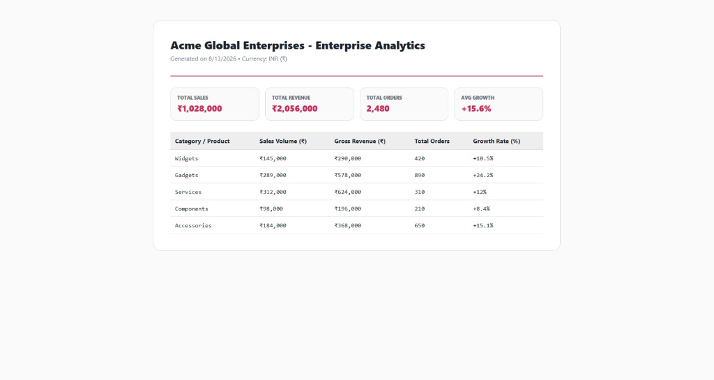 | 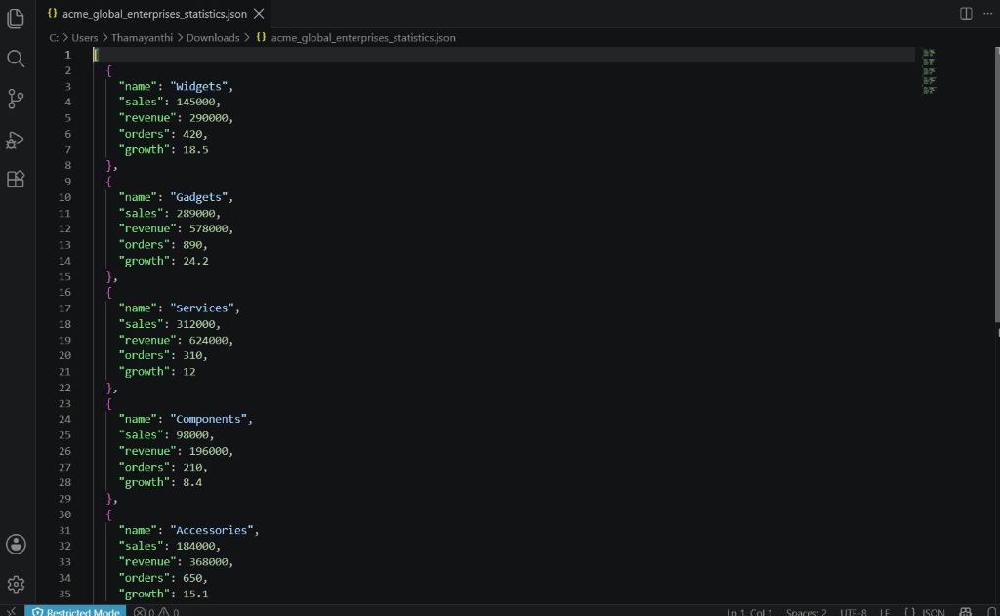 | 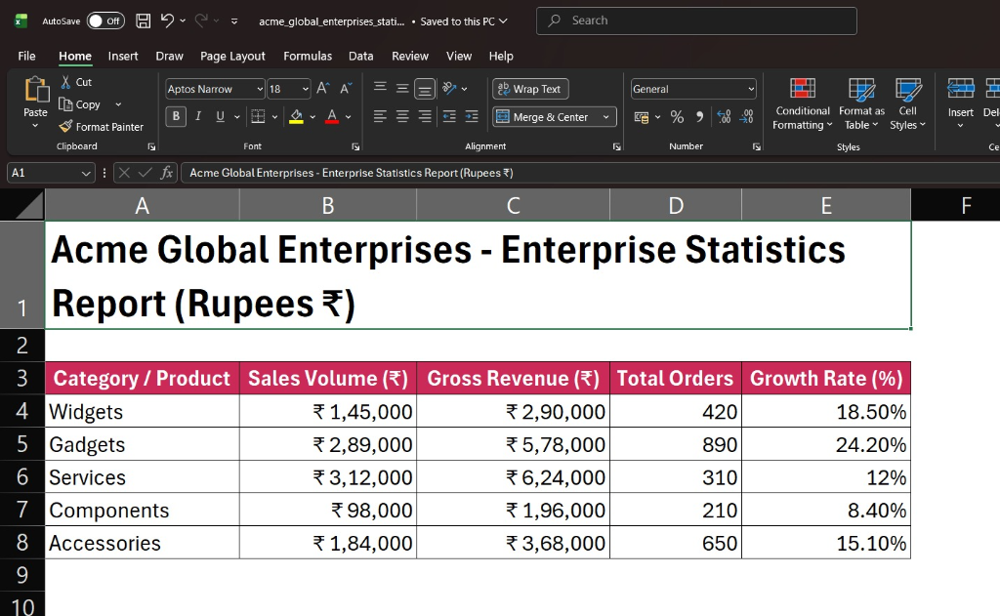 |

| Professional Executive Reports Hub |
|---|
|  |

### ⚙️ 6. Project Spaces & Data Connections
Manage multiple database connections and configure custom company contexts.
* Supports **SQLite, PostgreSQL, MySQL, and Supabase** database connectors.
* Create workspaces and customize company profile reporting currencies (e.g. INR ₹).

| Projects & Connections | Workspace Settings |
|---|---|
| 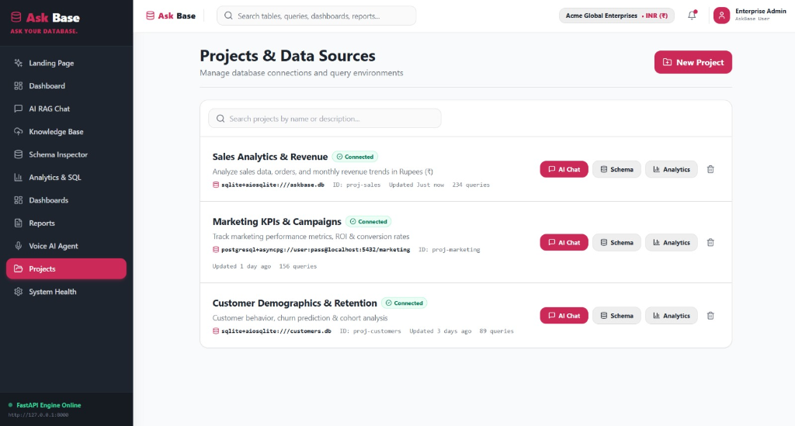 | 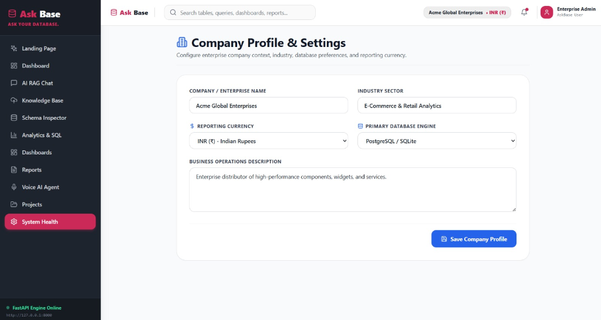 |

### 📈 7. Custom Dashboard Builder & Widgets
Create custom dashboard workspaces and add new visual widgets (Bar Charts, Line Charts, KPI Metric Cards) via the interactive modal.
| Custom Dashboard Workspace | Add Dashboard Widget Modal |
|---|---|
| 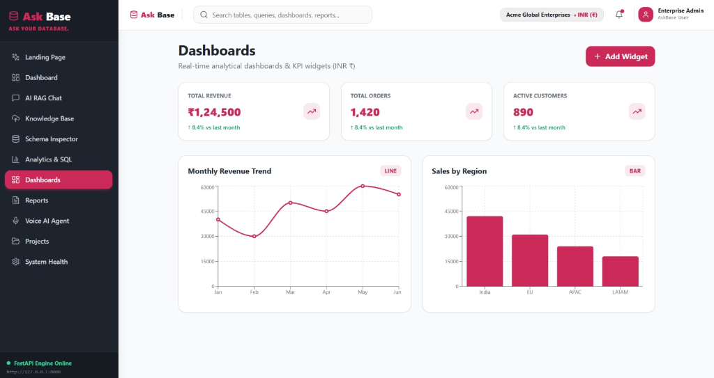 | 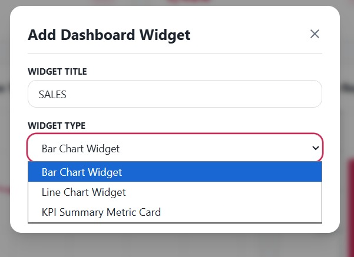 |

### 🎙️ 8. Autonomous Voice AI Agent
Query and command your data workspace verbally. The agent features two modes: Listening for input, and Speaking answers aloud using Gemini STT/TTS normalization.
| Listening Mode | Speaking Mode |
|---|---|
|  | 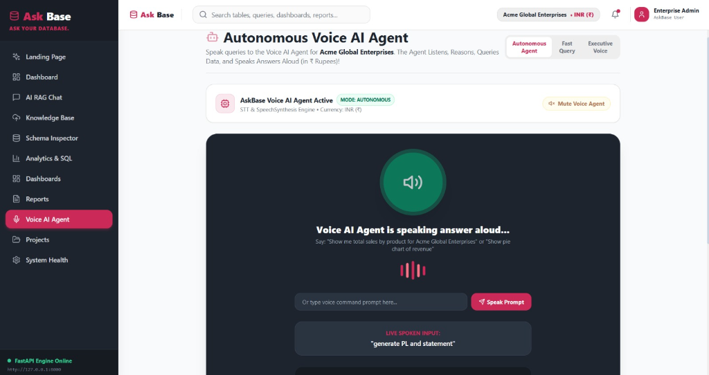 |

---

## 🏗️ Architecture Modules

* **Module 1 – Frontend (`frontend/`):** A modern, high-performance SPA built with **React**, **TypeScript**, **Vite**, and styled with **TailwindCSS**.
* **Module 2 – AI Backend (`ai-backend/`):** Core **FastAPI** web service orchestrating Gemini LLM agents, SQL parsers, and custom tools.
* **Module 3 – Data & Output Engine:** Database connector, report generators (PDF/PPT), and data exporters.

---

## 🚀 Quick Start

### Prerequisites
* **Node.js** (v18+)
* **Python** (3.11+) or **uv** (recommended)

### 1. Run the Backend Server
```bash
# Navigate to the backend directory
cd ai-backend

# Install dependencies and start server with uv (fastest)
uv pip install -r requirements.txt
uv run uvicorn main:app --host 127.0.0.1 --port 8000 --reload
```
The FastAPI documentation will be available at [http://127.0.0.1:8000/docs](http://127.0.0.1:8000/docs).

### 2. Run the Frontend Dev Server
```bash
# Navigate to the frontend directory
cd frontend

# Install Node modules and start Vite development server
npm install
npm run dev
```
Open [http://localhost:5173/](http://localhost:5173/) in your browser to view the application.

---

## 🧪 Running Tests

Ensure your backend changes are solid by running the backend test suite:
```bash
cd ai-backend
# Run the pytest test suite
uv run pytest
```

---

## 📄 License
Licensed under the [MIT License](LICENSE).
