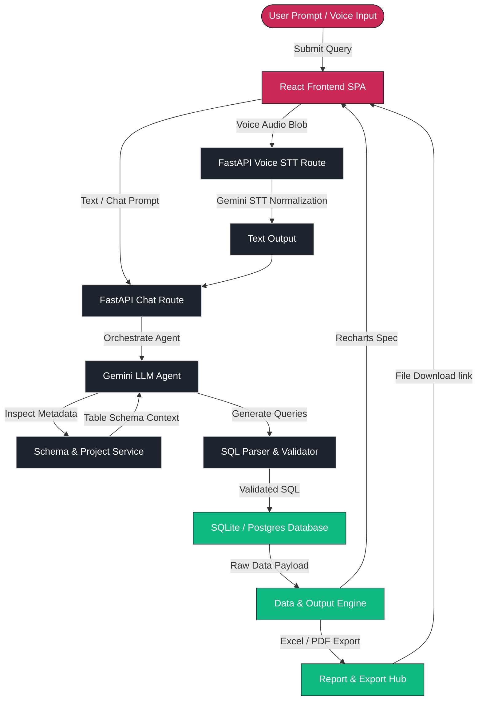

# AskBase System Workflow & Page Directory

This document details the system-wide data flow, processing pipelines, and a directory of the interface pages available in the AskBase platform.

---

## 📊 System Workflow Diagram

The diagram below visualizes the lifecycle of a query in AskBase—from user input (text or voice) to automated SQL generation, execution, and rendering of visual/document outputs.

---

## 🖥️ Page Directory & Descriptions

AskBase features a clean, responsive sidebar navigation accessing these specialized interface workspaces:

### 1. Main Dashboard (`/`)
* **Purpose:** High-level platform control center.
* **Key Components:**
  * **System Status Monitors:** Displays real-time API connection health cards for the FastAPI Backend, Data & Output Engine, and Gemini voice STT pipeline.
  * **Quick Actions:** Instant buttons to launch the AI chat workspace or inspect database schemas.

### 2. Login & Sign Up (`/login`)
* **Purpose:** Team authentication portal.
* **Key Components:**
  * **OAuth Integration:** One-click Google and GitHub login wrappers.
  * **Create Account Dialog:** Styled account creation modal matching enterprise profiles.

### 3. Projects & Data Sources (`/projects`)
* **Purpose:** Multi-database connection manager.
* **Key Components:**
  * **Connection Builder:** Add custom database connection strings (SQLite, PostgreSQL, MySQL, Supabase).
  * **Data Workspaces:** Switch database environments to query different database scopes.

### 4. AI RAG Chat Workspace (`/chat` or `/chat/:projectId`)
* **Purpose:** Core query interface.
* **Key Components:**
  * **Command Menu:** Interactive popup suggestion lists for **Slash Commands** (`/report`, `/schema`, etc.) and **@ Table Tags** (`@sales`, `@customers`, etc.).
  * **RAG Context Box:** Visual indicators showing what documents are actively grounding the conversation.

### 5. Schema Inspector & AI Autopilot (`/schema`)
* **Purpose:** Structural database explorer.
* **Key Components:**
  * **Autopilot & Root Cause:** Execute AI diagnostics to analyze anomalies or map metadata.
  * **Table Explorer:** Visual breakdown of tables, columns, primary/foreign keys, and data types.

### 6. Dashboards & KPI Builder (`/dashboards`)
* **Purpose:** Visual workspace layout.
* **Key Components:**
  * **KPI Summary Cards:** Track metrics like Total Revenue, Total Orders, or Active Customers.
  * **Add Widget Modal:** Add custom layout elements (Bar Charts, Line Charts, or Summary Cards).

### 7. Executive Reports Hub (`/reports`)
* **Purpose:** Export and document repository.
* **Key Components:**
  * **Reports List:** Download previously generated PDF/Excel executive summaries.
  * **Format Selectors:** Action buttons to instantly query and export JSON, Excel, PDF, or CSV tables.

### 8. Autonomous Voice Agent (`/voice`)
* **Purpose:** Hands-free voice interface.
* **Key Components:**
  * **Mic Normalization:** Real-time visual recording canvas with speak and listen status indicators.
  * **Gemini voice Pipeline:** Verbal query processing returning auditory responses.

### 9. Workspace Settings (`/settings`)
* **Purpose:** Context customization.
* **Key Components:**
  * **Currency Selector:** Support for 35+ global currencies (INR, USD, EUR, GBP, JPY, etc.).
  * **Operations Settings:** Configure company profiles, sectors, and business descriptions.
